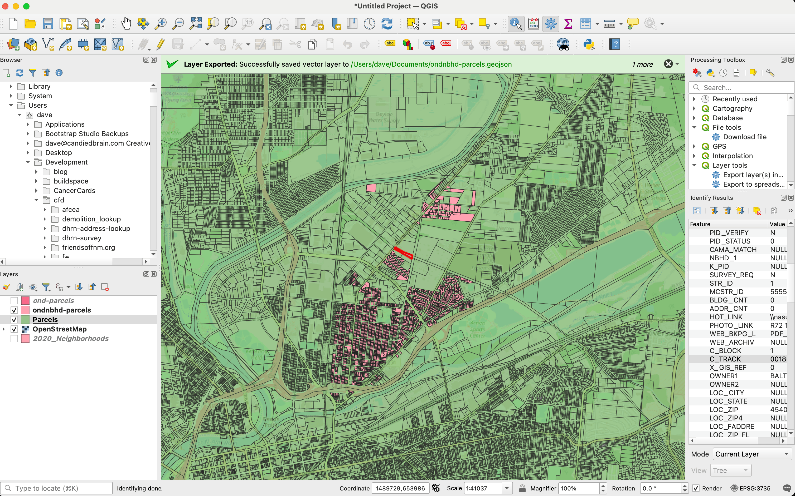
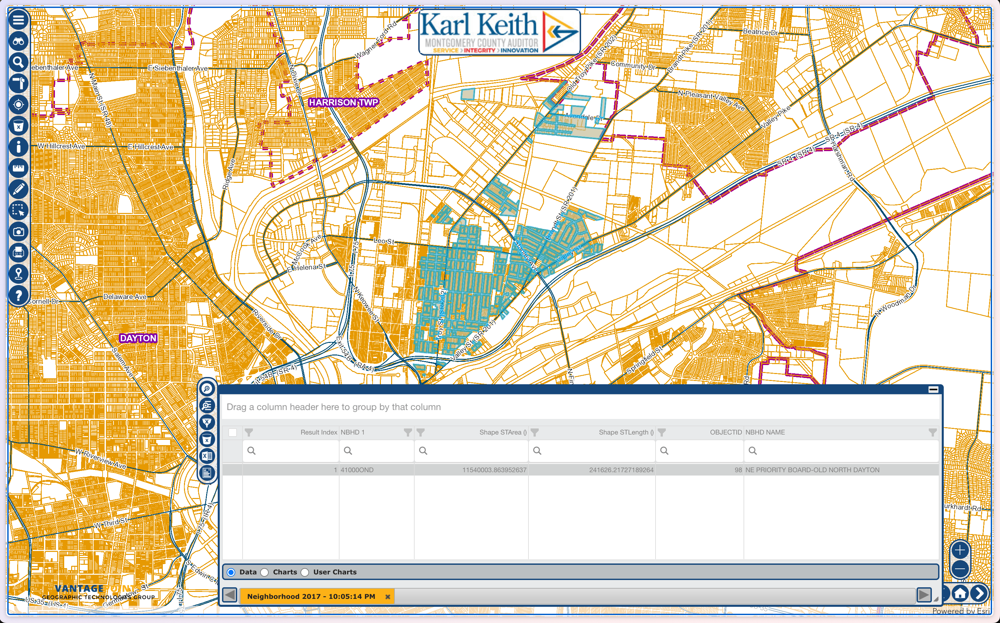

# Mapping properties for Old North Dayton

## Find the neighborhood boundaries

Two potential paths:
- Find the boundaries and identify properties within the boundary
- Less exact, but potentially easier.
- Easier to visualize.
- https://liveindayton.org/map/
- https://mistythomastrout.wordpress.com/portfolio/city-of-dayton-neighborhoods-map/
- Identify the properties by some field in the data.
- Will allow for exact matching, but doesn't visualize as well

Exploring the data
- NBHD: 41000OND
- C_TRACK: 001800
- https://www2.census.gov/geo/maps/dc10map/tract/st39_oh/c39113_montgomery/DC10CT_C39113_001.pdf
- https://www.qgis.org/
- https://gis.mcohio.org/VPCore/VP.html?config=aud

We're going to go with Census Track identifier - less specific, but still identifies every property.

## Find the properties on the rental registry.
We are using the `registry.json` file, which we generated from our [rental registry scraper](https://github.com/codefordayton/property_owner_accountability). 

## Find the nuisance list for properties.
We are using the housing_complaints.csv file, which we downloaded from the City of Dayton's open data portal, [here](https://daytonohio.maps.arcgis.com/apps/webappviewer/index.html?id=6191ca53bcb3416b808490135ad23b69).

## Data Processing Scripts

### filter_registry.py
This script filters the `registry.json` file to include only those records whose `parcel` field matches a `TAXPINNO` value found in the `ond-parcels.geojson` file. The filtered records are saved to a new file called `filtered_registry.json`. This is useful for narrowing down the registry data to only those parcels present in the geojson dataset.

### count_records.py
This script counts and compares the number of records in `registry.json` and `filtered_registry.json`. It prints the total number of records in each file and the percentage of records retained after filtering. This helps to quickly assess the impact of the filtering process.

### merge_data.py
This script merges the filtered registry data (`filtered_registry.json`) with the housing complaints data (`housingcomplaints_geocoded.csv`). It adds a `type` field to each record to distinguish between registry records and complaints. The merged data is saved in `merged_data.json` with two arrays: one for registry records and one for complaints that match the filtered registry parcels. This enables combined analysis of property registry and complaint data.

### geocode_housingcomplaints.py
This script geocodes the housing complaints data by matching complaint addresses to a coordinates lookup table (such as `output.csv`). It adds latitude, longitude, and TAXPINNO fields to each complaint record based on address matching, and saves the results to a new CSV file (default: `housingcomplaints_geocoded.csv`). This enables spatial analysis and parcel-level matching of housing complaints.

## Data Files

### ond-parcels.geojson
This is the geojson file containing the parcel boundaries for Old North Dayton based on the Census Tract code.

### housingcomplaints.csv
This is the housing complaints data from the City of Dayton.

### housingcomplaints_geocoded.csv
This is the geocoded housing complaints data with latitude, longitude, and TAXPINNO fields added.

### merged_data.json
This is the merged data between the filtered registry and the geocoded housing complaints data.

